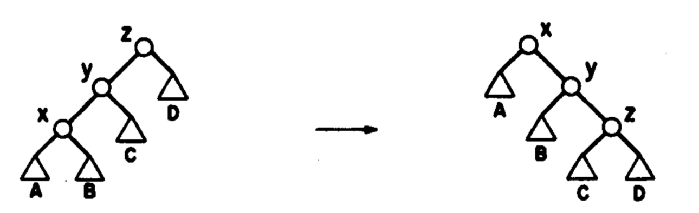

1. Dany jest ciąg rekurencyjny liczb całkowitych określony wzorem:

   $$
   a_n =
   \begin{cases}
     0                                           & \text{dla } n = 0   \\
     2                                           & \text{dla } n = 1   \\
     3                                           & \text{dla } n = 2   \\
     -1                                          & \text{dla } n = 3   \\
     a_{n-1} - 3a_{n-2} + 5a_{n-3} - a_{n-4} + 2 & \text{dla } n \ge 4
   \end{cases}
   $$

   napisz procedurę rekursywną, która dla zadanej wartości całkowitej indeksu
   $n$ zwraca wartość elementu $a_n$. Procedura powinna być napisana w sposób
   optymalny, w szczególności należy zapobiec wielokrotnym wywołaniom
   rekursywnym tej procedury dla tych samych argumentów.

2. Napisz funkcję o nagłówku

   ```cpp
   double SredniaTablicy(int p, int k, double* tab)
   ```

   która dla zadanej tablicy liczb rzeczywistych `tab`, indeksów jej początku $(p)$
   i końca $(k)$, stosując rekursywny podział tablicy na podtablice (metodą
   "Divide and conquer", analogiczna jak w przypadku sortowania "MergeSort")
   wyznaczy średnią harmoniczną liczb w zadanej tablicy.

   Uwaga: Średnia harmoniczna tablicy 1-elementowej jest równa wartości tego
   elementu. Średnia harmoniczna tablicy utworzonej z 2 podtablic długości
   odpowiednio $n_1$ i $n_2$, gdzie $a_1$ jest średnią harmoniczną lewej
   podtablicy, a $a_2$ jest średnią harmoniczną prawej podtablicy jest równa $a$,
   gdzie

   $$
   a = \frac{n_1 + n_2}{\frac{n_1}{a_1} + \frac{n_2}{a_2}}
   $$

3. Dane są następujące deklaracje implementujące drzewo binarne:

   ```cpp
   class Element {
       private:
           Element *left;
           Element *right;
           Element *parent;
       public:
           // ...
           void SetLeft(Element *el);
           void SetRight(Element *el);
           void SetParent(Element *el);
           Element *GetLeft();
           Element *GetRight();
           Element *GetParent();
   };

   class Drzewo {
       private:
           Element *root;
       public:
           // ...
           void Obrot2Right(Element *z);
   };
   ```

   Metody klasy `Element`: `SetLeft`, `SetRight` i `SetParent` ustawiają na
   zadany wskaźnik odpowiednio pola `left`, `right` i `parent`, zaś metody
   `GetLeft`, `GetRight` i `GetParent` zwracają odpowiednio wskaźniki `left`,
   `right` i `parent`. Zapisz treść metody `Obrot2Right`, która ma za zadanie
   wykonać podwójny obrót w prawo drzewa względem elementu `z`, do którego
   wskaźnik jest argumentem tej metody. Postać drzewa przed obrotem i po obrocie
   została pokazana na poniższym rysunku:

   

   Zakładamy, że zarówno element $z$, jak i jego lewy syn, oraz lewy syn lewego
   syna znajdują się w drzewie. Element $z$ może być zarówno korzeniem drzewa, jak
   również może mieć ojca.

4. Dane są następujące deklaracje:

   ```cpp
   class Pacjent {
       private:
           Pacjent *next;
           Pacjent *prev;
           bool Covidowy;
       public:
           // ...
           bool GetCov();
           Pacjent *Kopiuj();
           void SetNext(Pacjent *el);
           void SetPrev(Pacjent *el);
           Pacjent *GetNext();
           Pacjent *GetPrev();
   };

   class Kolejka {
       private:
           Pacjent *head;
           Pacjent *tail;
       public:
           // ...
           Pacjent *Front();
           void Attach(Pacjent *p);
           void Detach();
           bool EmptyQueue();
           void Podziel(Kolejka *covidowi, Kolejka *niecovidowi);
   };
   ```

   Metody klasy Pacjent przechowującej informacje o pacjentach stojących w
   kolejce do lekarza: `SetNext` i `SetPrev` ustawiają na zadany wskaźnik
   odpowiednio pola `next` i `prev`, zaś metody `GetNext` i `GetPrev` zwracają
   odpowiednio wskaźniki `next` i `prev`. Metoda `GetCov` zwraca `true` jeśli
   pacjent jest chory na `Covid`, zaś metoda `Kopiuj` tworzy nowy obiekt
   reprezentujący pacjenta i kopiuje do niego jego dane.

   Metody klasy `Kolejka` stanowią implementację kolejki w sposób podany na
   wykładzie i zajęciach laboratoryjnych: metoda `Front` zwraca wskaźnik do
   pacjenta na początku kolejki, metoda `Attach` dodaje pacjenta określonego
   przez wskaźnik p do kolejki, metoda `Detach` usuwa pacjenta na przedzie
   kolejki z kolejki [i usuwa go z pamięci komputera]{.underline}, metoda
   `EmptyQueue` zwraca informację, czy kolejka jest pusta.

   Zapisz treść metody `Podziel`, która po kolei sprawdza czy pacjenci stojący w
   kolejce wywołującej tę metodę są chorzy na Covid i jeśli pacjent jest chory
   na Covid, to dodaje go do kolejki `covidowi`, w przeciwnym razie dodaje go do
   kolejki `niecovidowi`. Metoda kończy działanie po opróżnieniu kolejki.
   Zakładamy, że kolejki `covidowi` i `niecovidowi` są już utworzone.
