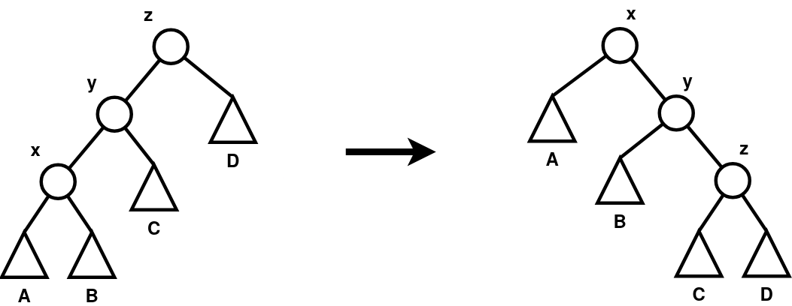

1. Dany jest ciąg rekurencyjny liczb całkowitych określony wzorem:

   $$
   a_n =
   \begin{cases}
     0                                           & \text{dla } n = 0   \\
     2                                           & \text{dla } n = 1   \\
     3                                           & \text{dla } n = 2   \\
     -1                                          & \text{dla } n = 3   \\
     a_{n-1} - 3a_{n-2} + 5a_{n-3} - a_{n-4} + 2 & \text{dla } n \ge 4
   \end{cases}
   $$

   napisz procedurę rekursywną, która dla zadanej wartości całkowitej indeksu
   $n$ zwraca wartość elementu $a_n$. Procedura powinna być napisana w sposób
   optymalny, w szczególności należy zapobiec wielokrotnym wywołaniom
   rekursywnym tej procedury dla tych samych argumentów.

2. Napisz funkcję o nagłówku

   ```cpp
   double SredniaTablicy(int p, int k, double* tab)
   ```

   która dla zadanej tablicy liczb rzeczywistych `tab`, indeksów jej początku $(p)$
   i końca $(k)$, stosując rekursywny podział tablicy na podtablice (metodą
   "Divide and conquer", analogiczna jak w przypadku sortowania "MergeSort")
   wyznaczy średnią harmoniczną liczb w zadanej tablicy.

   Uwaga: Średnia harmoniczna tablicy 1-elementowej jest równa wartości tego
   elementu. Średnia harmoniczna tablicy utworzonej z 2 podtablic długości
   odpowiednio $n_1$ i $n_2$, gdzie $a_1$ jest średnią harmoniczną lewej
   podtablicy, a $a_2$ jest średnią harmoniczną prawej podtablicy jest równa $a$,
   gdzie

   $$
   a = \frac{n_1 + n_2}{\frac{n_1}{a_1} + \frac{n_2}{a_2}}
   $$

3. Dane są następujące deklaracje implementujące drzewo binarne:

   ```cpp
   class Element {
       private:
           Element *left;
           Element *right;
           Element *parent;
       public:
           // ...
           void SetLeft(Element *el);
           void SetRight(Element *el);
           void SetParent(Element *el);
           Element *GetLeft();
           Element *GetRight();
           Element *GetParent();
   };

   class Drzewo {
       private:
           Element *root;
       public:
           // ...
           void Obrot2Right(Element *z);
   };
   ```

   Metody klasy `Element`: `SetLeft`, `SetRight` i `SetParent` ustawiają na
   zadany wskaźnik odpowiednio pola `left`, `right` i `parent`, zaś metody
   `GetLeft`, `GetRight` i `GetParent` zwracają odpowiednio wskaźniki `left`,
   `right` i `parent`. Zapisz treść metody `Obrot2Right`, która ma za zadanie
   wykonać podwójny obrót w prawo drzewa względem elementu `z`, do którego
   wskaźnik jest argumentem tej metody. Postać drzewa przed obrotem i po obrocie
   została pokazana na poniższym rysunku:

   

   Zakładamy, że zarówno element $z$, jak i jego lewy syn, oraz lewy syn lewego
   syna znajdują się w drzewie. Element $z$ może być zarówno korzeniem drzewa, jak
   również może mieć ojca.

4. Dane są następujące deklaracje:

   ```cpp
   class Pacjent {
       private:
           Pacjent *next;
           Pacjent *prev;
           bool Covidowy;
       public:
           // ...
           bool GetCov();
           Pacjent *Kopiuj();
           void SetNext(Pacjent *el);
           void SetPrev(Pacjent *el);
           Pacjent *GetNext();
           Pacjent *GetPrev();
   };

   class Kolejka {
       private:
           Pacjent *head;
           Pacjent *tail;
       public:
           // ...
           Pacjent *Front();
           void Attach(Pacjent *p);
           void Detach();
           bool EmptyQueue();
           void Podziel(Kolejka *covidowi, Kolejka *niecovidowi);
   };
   ```

   Metody klasy Pacjent przechowującej informacje o pacjentach stojących w
   kolejce do lekarza: `SetNext` i `SetPrev` ustawiają na zadany wskaźnik
   odpowiednio pola `next` i `prev`, zaś metody `GetNext` i `GetPrev` zwracają
   odpowiednio wskaźniki `next` i `prev`. Metoda `GetCov` zwraca `true` jeśli
   pacjent jest chory na `Covid`, zaś metoda `Kopiuj` tworzy nowy obiekt
   reprezentujący pacjenta i kopiuje do niego jego dane.

   Metody klasy `Kolejka` stanowią implementację kolejki w sposób podany na
   wykładzie i zajęciach laboratoryjnych: metoda `Front` zwraca wskaźnik do
   pacjenta na początku kolejki, metoda `Attach` dodaje pacjenta określonego
   przez wskaźnik p do kolejki, metoda `Detach` usuwa pacjenta na przedzie
   kolejki z kolejki [i usuwa go z pamięci komputera]{.underline}, metoda
   `EmptyQueue` zwraca informację, czy kolejka jest pusta.

   Zapisz treść metody `Podziel`, która po kolei sprawdza czy pacjenci stojący w
   kolejce wywołującej tę metodę są chorzy na Covid i jeśli pacjent jest chory
   na Covid, to dodaje go do kolejki `covidowi`, w przeciwnym razie dodaje go do
   kolejki `niecovidowi`. Metoda kończy działanie po opróżnieniu kolejki.
   Zakładamy, że kolejki `covidowi` i `niecovidowi` są już utworzone.

<!--
Kod źródłowy rysunku (draw.io)

```xml
<mxfile host="app.diagrams.net" agent="" version="28.0.7">
  <diagram name="Page-1" id="ePjIl8lMhpe3q2hmHJdZ">
    <mxGraphModel dx="939" dy="625" grid="1" gridSize="10" guides="1" tooltips="1" connect="1" arrows="1" fold="1" page="1" pageScale="1" pageWidth="700" pageHeight="280" math="0" shadow="0">
      <root>
        <mxCell id="0" />
        <mxCell id="1" parent="0" />
        <mxCell id="8EQ6qmDTKBysUapky-ZA-21" value="" style="edgeStyle=none;rounded=0;html=1;jettySize=auto;orthogonalLoop=1;strokeColor=#000000;strokeWidth=6;endArrow=classic;endFill=1;" parent="1" edge="1">
          <mxGeometry width="50" height="50" relative="1" as="geometry">
            <mxPoint x="306" y="134.52" as="sourcePoint" />
            <mxPoint x="386" y="134.52" as="targetPoint" />
          </mxGeometry>
        </mxCell>
        <mxCell id="h3xNfCrNYxNAOBHWeBhy-2" value="" style="group" vertex="1" connectable="0" parent="1">
          <mxGeometry x="469" width="230" height="270" as="geometry" />
        </mxCell>
        <mxCell id="8EQ6qmDTKBysUapky-ZA-22" value="" style="ellipse;whiteSpace=wrap;html=1;aspect=fixed;fillColor=#ffffff;strokeColor=#000000;strokeWidth=3;" parent="h3xNfCrNYxNAOBHWeBhy-2" vertex="1">
          <mxGeometry x="115" y="85" width="30" height="30" as="geometry" />
        </mxCell>
        <mxCell id="8EQ6qmDTKBysUapky-ZA-23" value="" style="ellipse;whiteSpace=wrap;html=1;aspect=fixed;fillColor=#ffffff;strokeColor=#000000;strokeWidth=3;" parent="h3xNfCrNYxNAOBHWeBhy-2" vertex="1">
          <mxGeometry x="65" y="25" width="30" height="30" as="geometry" />
        </mxCell>
        <mxCell id="8EQ6qmDTKBysUapky-ZA-24" value="" style="ellipse;whiteSpace=wrap;html=1;aspect=fixed;fillColor=#ffffff;strokeColor=#000000;strokeWidth=3;" parent="h3xNfCrNYxNAOBHWeBhy-2" vertex="1">
          <mxGeometry x="165" y="145" width="30" height="30" as="geometry" />
        </mxCell>
        <mxCell id="8EQ6qmDTKBysUapky-ZA-25" value="" style="shape=triangle;perimeter=trianglePerimeter;whiteSpace=wrap;html=1;fillColor=#ffffff;strokeColor=#000000;strokeWidth=3;rotation=270;" parent="h3xNfCrNYxNAOBHWeBhy-2" vertex="1">
          <mxGeometry y="85" width="40" height="40" as="geometry" />
        </mxCell>
        <mxCell id="8EQ6qmDTKBysUapky-ZA-26" value="" style="shape=triangle;perimeter=trianglePerimeter;whiteSpace=wrap;html=1;fillColor=#ffffff;strokeColor=#000000;strokeWidth=3;rotation=270;" parent="h3xNfCrNYxNAOBHWeBhy-2" vertex="1">
          <mxGeometry x="60" y="140" width="40" height="40" as="geometry" />
        </mxCell>
        <mxCell id="8EQ6qmDTKBysUapky-ZA-27" value="" style="shape=triangle;perimeter=trianglePerimeter;whiteSpace=wrap;html=1;fillColor=#ffffff;strokeColor=#000000;strokeWidth=3;rotation=270;" parent="h3xNfCrNYxNAOBHWeBhy-2" vertex="1">
          <mxGeometry x="130" y="205" width="40" height="40" as="geometry" />
        </mxCell>
        <mxCell id="8EQ6qmDTKBysUapky-ZA-28" value="" style="shape=triangle;perimeter=trianglePerimeter;whiteSpace=wrap;html=1;fillColor=#ffffff;strokeColor=#000000;strokeWidth=3;rotation=270;" parent="h3xNfCrNYxNAOBHWeBhy-2" vertex="1">
          <mxGeometry x="190" y="205" width="40" height="40" as="geometry" />
        </mxCell>
        <mxCell id="8EQ6qmDTKBysUapky-ZA-29" value="y" style="text;html=1;strokeColor=none;fillColor=none;align=center;verticalAlign=middle;whiteSpace=wrap;rounded=0;fontStyle=1;fontSize=16;" parent="h3xNfCrNYxNAOBHWeBhy-2" vertex="1">
          <mxGeometry x="130" y="60" width="20" height="20" as="geometry" />
        </mxCell>
        <mxCell id="8EQ6qmDTKBysUapky-ZA-30" value="x" style="text;html=1;strokeColor=none;fillColor=none;align=center;verticalAlign=middle;whiteSpace=wrap;rounded=0;fontStyle=1;fontSize=16;" parent="h3xNfCrNYxNAOBHWeBhy-2" vertex="1">
          <mxGeometry x="80" width="20" height="20" as="geometry" />
        </mxCell>
        <mxCell id="8EQ6qmDTKBysUapky-ZA-31" value="z" style="text;html=1;strokeColor=none;fillColor=none;align=center;verticalAlign=middle;whiteSpace=wrap;rounded=0;fontStyle=1;fontSize=16;" parent="h3xNfCrNYxNAOBHWeBhy-2" vertex="1">
          <mxGeometry x="180" y="120" width="20" height="20" as="geometry" />
        </mxCell>
        <mxCell id="8EQ6qmDTKBysUapky-ZA-32" value="A" style="text;html=1;strokeColor=none;fillColor=none;align=center;verticalAlign=middle;whiteSpace=wrap;rounded=0;fontStyle=1;fontSize=16;" parent="h3xNfCrNYxNAOBHWeBhy-2" vertex="1">
          <mxGeometry x="10" y="130" width="20" height="20" as="geometry" />
        </mxCell>
        <mxCell id="8EQ6qmDTKBysUapky-ZA-33" value="B" style="text;html=1;strokeColor=none;fillColor=none;align=center;verticalAlign=middle;whiteSpace=wrap;rounded=0;fontStyle=1;fontSize=16;" parent="h3xNfCrNYxNAOBHWeBhy-2" vertex="1">
          <mxGeometry x="70" y="185" width="20" height="20" as="geometry" />
        </mxCell>
        <mxCell id="8EQ6qmDTKBysUapky-ZA-34" value="C" style="text;html=1;strokeColor=none;fillColor=none;align=center;verticalAlign=middle;whiteSpace=wrap;rounded=0;fontStyle=1;fontSize=16;" parent="h3xNfCrNYxNAOBHWeBhy-2" vertex="1">
          <mxGeometry x="140" y="250" width="20" height="20" as="geometry" />
        </mxCell>
        <mxCell id="8EQ6qmDTKBysUapky-ZA-35" value="D" style="text;html=1;strokeColor=none;fillColor=none;align=center;verticalAlign=middle;whiteSpace=wrap;rounded=0;fontStyle=1;fontSize=16;" parent="h3xNfCrNYxNAOBHWeBhy-2" vertex="1">
          <mxGeometry x="200" y="250" width="20" height="20" as="geometry" />
        </mxCell>
        <mxCell id="8EQ6qmDTKBysUapky-ZA-36" value="" style="edgeStyle=none;rounded=0;html=1;jettySize=auto;orthogonalLoop=1;strokeColor=#000000;strokeWidth=3;endArrow=none;endFill=0;" parent="h3xNfCrNYxNAOBHWeBhy-2" source="8EQ6qmDTKBysUapky-ZA-22" target="8EQ6qmDTKBysUapky-ZA-23" edge="1">
          <mxGeometry relative="1" as="geometry" />
        </mxCell>
        <mxCell id="8EQ6qmDTKBysUapky-ZA-37" value="" style="edgeStyle=none;rounded=0;html=1;jettySize=auto;orthogonalLoop=1;strokeColor=#000000;strokeWidth=3;endArrow=none;endFill=0;" parent="h3xNfCrNYxNAOBHWeBhy-2" source="8EQ6qmDTKBysUapky-ZA-22" target="8EQ6qmDTKBysUapky-ZA-24" edge="1">
          <mxGeometry relative="1" as="geometry" />
        </mxCell>
        <mxCell id="8EQ6qmDTKBysUapky-ZA-38" value="" style="edgeStyle=none;rounded=0;html=1;jettySize=auto;orthogonalLoop=1;strokeColor=#000000;strokeWidth=3;endArrow=none;endFill=0;entryX=1;entryY=0.5;entryDx=0;entryDy=0;" parent="h3xNfCrNYxNAOBHWeBhy-2" source="8EQ6qmDTKBysUapky-ZA-23" target="8EQ6qmDTKBysUapky-ZA-25" edge="1">
          <mxGeometry relative="1" as="geometry" />
        </mxCell>
        <mxCell id="8EQ6qmDTKBysUapky-ZA-39" value="" style="edgeStyle=none;rounded=0;html=1;jettySize=auto;orthogonalLoop=1;strokeColor=#000000;strokeWidth=3;endArrow=none;endFill=0;entryX=1;entryY=0.5;entryDx=0;entryDy=0;" parent="h3xNfCrNYxNAOBHWeBhy-2" source="8EQ6qmDTKBysUapky-ZA-22" target="8EQ6qmDTKBysUapky-ZA-26" edge="1">
          <mxGeometry relative="1" as="geometry" />
        </mxCell>
        <mxCell id="8EQ6qmDTKBysUapky-ZA-40" value="" style="edgeStyle=none;rounded=0;html=1;jettySize=auto;orthogonalLoop=1;strokeColor=#000000;strokeWidth=3;endArrow=none;endFill=0;entryX=1;entryY=0.5;entryDx=0;entryDy=0;" parent="h3xNfCrNYxNAOBHWeBhy-2" source="8EQ6qmDTKBysUapky-ZA-24" target="8EQ6qmDTKBysUapky-ZA-27" edge="1">
          <mxGeometry relative="1" as="geometry" />
        </mxCell>
        <mxCell id="8EQ6qmDTKBysUapky-ZA-41" value="" style="edgeStyle=none;rounded=0;html=1;jettySize=auto;orthogonalLoop=1;strokeColor=#000000;strokeWidth=3;endArrow=none;endFill=0;entryX=1;entryY=0.5;entryDx=0;entryDy=0;" parent="h3xNfCrNYxNAOBHWeBhy-2" source="8EQ6qmDTKBysUapky-ZA-24" target="8EQ6qmDTKBysUapky-ZA-28" edge="1">
          <mxGeometry relative="1" as="geometry" />
        </mxCell>
        <mxCell id="h3xNfCrNYxNAOBHWeBhy-3" value="" style="group" vertex="1" connectable="0" parent="1">
          <mxGeometry x="0.9999999999999964" y="1" width="225" height="270" as="geometry" />
        </mxCell>
        <mxCell id="8EQ6qmDTKBysUapky-ZA-1" value="" style="ellipse;whiteSpace=wrap;html=1;aspect=fixed;fillColor=#ffffff;strokeColor=#000000;strokeWidth=3;" parent="h3xNfCrNYxNAOBHWeBhy-3" vertex="1">
          <mxGeometry x="135" y="25" width="30" height="30" as="geometry" />
        </mxCell>
        <mxCell id="8EQ6qmDTKBysUapky-ZA-2" value="" style="ellipse;whiteSpace=wrap;html=1;aspect=fixed;fillColor=#ffffff;strokeColor=#000000;strokeWidth=3;" parent="h3xNfCrNYxNAOBHWeBhy-3" vertex="1">
          <mxGeometry x="85" y="85" width="30" height="30" as="geometry" />
        </mxCell>
        <mxCell id="8EQ6qmDTKBysUapky-ZA-3" value="" style="ellipse;whiteSpace=wrap;html=1;aspect=fixed;fillColor=#ffffff;strokeColor=#000000;strokeWidth=3;" parent="h3xNfCrNYxNAOBHWeBhy-3" vertex="1">
          <mxGeometry x="35" y="145" width="30" height="30" as="geometry" />
        </mxCell>
        <mxCell id="8EQ6qmDTKBysUapky-ZA-4" value="" style="shape=triangle;perimeter=trianglePerimeter;whiteSpace=wrap;html=1;fillColor=#ffffff;strokeColor=#000000;strokeWidth=3;rotation=270;" parent="h3xNfCrNYxNAOBHWeBhy-3" vertex="1">
          <mxGeometry x="3.552713678800501e-15" y="205" width="40" height="40" as="geometry" />
        </mxCell>
        <mxCell id="8EQ6qmDTKBysUapky-ZA-5" value="" style="shape=triangle;perimeter=trianglePerimeter;whiteSpace=wrap;html=1;fillColor=#ffffff;strokeColor=#000000;strokeWidth=3;rotation=270;" parent="h3xNfCrNYxNAOBHWeBhy-3" vertex="1">
          <mxGeometry x="60" y="205" width="40" height="40" as="geometry" />
        </mxCell>
        <mxCell id="8EQ6qmDTKBysUapky-ZA-6" value="" style="shape=triangle;perimeter=trianglePerimeter;whiteSpace=wrap;html=1;fillColor=#ffffff;strokeColor=#000000;strokeWidth=3;rotation=270;" parent="h3xNfCrNYxNAOBHWeBhy-3" vertex="1">
          <mxGeometry x="115" y="145" width="40" height="40" as="geometry" />
        </mxCell>
        <mxCell id="8EQ6qmDTKBysUapky-ZA-7" value="" style="shape=triangle;perimeter=trianglePerimeter;whiteSpace=wrap;html=1;fillColor=#ffffff;strokeColor=#000000;strokeWidth=3;rotation=270;" parent="h3xNfCrNYxNAOBHWeBhy-3" vertex="1">
          <mxGeometry x="185" y="85" width="40" height="40" as="geometry" />
        </mxCell>
        <mxCell id="8EQ6qmDTKBysUapky-ZA-8" value="z" style="text;html=1;strokeColor=none;fillColor=none;align=center;verticalAlign=middle;whiteSpace=wrap;rounded=0;fontStyle=1;fontSize=16;" parent="h3xNfCrNYxNAOBHWeBhy-3" vertex="1">
          <mxGeometry x="120" width="20" height="20" as="geometry" />
        </mxCell>
        <mxCell id="8EQ6qmDTKBysUapky-ZA-9" value="y" style="text;html=1;strokeColor=none;fillColor=none;align=center;verticalAlign=middle;whiteSpace=wrap;rounded=0;fontStyle=1;fontSize=16;" parent="h3xNfCrNYxNAOBHWeBhy-3" vertex="1">
          <mxGeometry x="70" y="60" width="20" height="20" as="geometry" />
        </mxCell>
        <mxCell id="8EQ6qmDTKBysUapky-ZA-10" value="x" style="text;html=1;strokeColor=none;fillColor=none;align=center;verticalAlign=middle;whiteSpace=wrap;rounded=0;fontStyle=1;fontSize=16;" parent="h3xNfCrNYxNAOBHWeBhy-3" vertex="1">
          <mxGeometry x="20.000000000000004" y="120" width="20" height="20" as="geometry" />
        </mxCell>
        <mxCell id="8EQ6qmDTKBysUapky-ZA-11" value="A" style="text;html=1;strokeColor=none;fillColor=none;align=center;verticalAlign=middle;whiteSpace=wrap;rounded=0;fontStyle=1;fontSize=16;" parent="h3xNfCrNYxNAOBHWeBhy-3" vertex="1">
          <mxGeometry x="10.000000000000004" y="250" width="20" height="20" as="geometry" />
        </mxCell>
        <mxCell id="8EQ6qmDTKBysUapky-ZA-12" value="B" style="text;html=1;strokeColor=none;fillColor=none;align=center;verticalAlign=middle;whiteSpace=wrap;rounded=0;fontStyle=1;fontSize=16;" parent="h3xNfCrNYxNAOBHWeBhy-3" vertex="1">
          <mxGeometry x="70" y="250" width="20" height="20" as="geometry" />
        </mxCell>
        <mxCell id="8EQ6qmDTKBysUapky-ZA-13" value="C" style="text;html=1;strokeColor=none;fillColor=none;align=center;verticalAlign=middle;whiteSpace=wrap;rounded=0;fontStyle=1;fontSize=16;" parent="h3xNfCrNYxNAOBHWeBhy-3" vertex="1">
          <mxGeometry x="125" y="190" width="20" height="20" as="geometry" />
        </mxCell>
        <mxCell id="8EQ6qmDTKBysUapky-ZA-14" value="D" style="text;html=1;strokeColor=none;fillColor=none;align=center;verticalAlign=middle;whiteSpace=wrap;rounded=0;fontStyle=1;fontSize=16;" parent="h3xNfCrNYxNAOBHWeBhy-3" vertex="1">
          <mxGeometry x="195" y="130" width="20" height="20" as="geometry" />
        </mxCell>
        <mxCell id="8EQ6qmDTKBysUapky-ZA-15" value="" style="edgeStyle=none;rounded=0;html=1;jettySize=auto;orthogonalLoop=1;strokeColor=#000000;strokeWidth=3;endArrow=none;endFill=0;" parent="h3xNfCrNYxNAOBHWeBhy-3" source="8EQ6qmDTKBysUapky-ZA-1" target="8EQ6qmDTKBysUapky-ZA-2" edge="1">
          <mxGeometry relative="1" as="geometry" />
        </mxCell>
        <mxCell id="8EQ6qmDTKBysUapky-ZA-16" value="" style="edgeStyle=none;rounded=0;html=1;jettySize=auto;orthogonalLoop=1;strokeColor=#000000;strokeWidth=3;endArrow=none;endFill=0;entryX=1;entryY=0.5;entryDx=0;entryDy=0;" parent="h3xNfCrNYxNAOBHWeBhy-3" source="8EQ6qmDTKBysUapky-ZA-1" target="8EQ6qmDTKBysUapky-ZA-7" edge="1">
          <mxGeometry relative="1" as="geometry" />
        </mxCell>
        <mxCell id="8EQ6qmDTKBysUapky-ZA-17" value="" style="edgeStyle=none;rounded=0;html=1;jettySize=auto;orthogonalLoop=1;strokeColor=#000000;strokeWidth=3;endArrow=none;endFill=0;" parent="h3xNfCrNYxNAOBHWeBhy-3" source="8EQ6qmDTKBysUapky-ZA-2" target="8EQ6qmDTKBysUapky-ZA-3" edge="1">
          <mxGeometry relative="1" as="geometry" />
        </mxCell>
        <mxCell id="8EQ6qmDTKBysUapky-ZA-18" value="" style="edgeStyle=none;rounded=0;html=1;jettySize=auto;orthogonalLoop=1;strokeColor=#000000;strokeWidth=3;endArrow=none;endFill=0;entryX=1;entryY=0.5;entryDx=0;entryDy=0;" parent="h3xNfCrNYxNAOBHWeBhy-3" source="8EQ6qmDTKBysUapky-ZA-2" target="8EQ6qmDTKBysUapky-ZA-6" edge="1">
          <mxGeometry relative="1" as="geometry" />
        </mxCell>
        <mxCell id="8EQ6qmDTKBysUapky-ZA-19" value="" style="edgeStyle=none;rounded=0;html=1;jettySize=auto;orthogonalLoop=1;strokeColor=#000000;strokeWidth=3;endArrow=none;endFill=0;entryX=1;entryY=0.5;entryDx=0;entryDy=0;" parent="h3xNfCrNYxNAOBHWeBhy-3" source="8EQ6qmDTKBysUapky-ZA-3" target="8EQ6qmDTKBysUapky-ZA-4" edge="1">
          <mxGeometry relative="1" as="geometry" />
        </mxCell>
        <mxCell id="8EQ6qmDTKBysUapky-ZA-20" value="" style="edgeStyle=none;rounded=0;html=1;jettySize=auto;orthogonalLoop=1;strokeColor=#000000;strokeWidth=3;endArrow=none;endFill=0;entryX=1;entryY=0.5;entryDx=0;entryDy=0;" parent="h3xNfCrNYxNAOBHWeBhy-3" source="8EQ6qmDTKBysUapky-ZA-3" target="8EQ6qmDTKBysUapky-ZA-5" edge="1">
          <mxGeometry relative="1" as="geometry" />
        </mxCell>
      </root>
    </mxGraphModel>
  </diagram>
</mxfile>
```
-->
