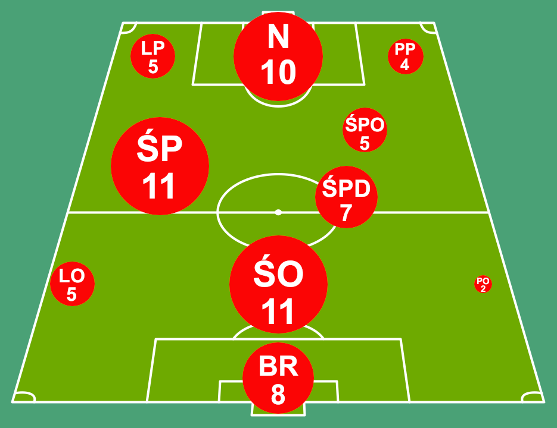

```{r setup, include=FALSE}

knitr::opts_chunk$set(echo = FALSE)
options(warn = -1)

suppressPackageStartupMessages({
  library(tidyverse)
  library(hrbrthemes)
  library(circlize)
  library(magick)
  library(factoextra)
})

```

```{r, echo=FALSE}
library(treemapify, quietly = TRUE, warn.conflicts = FALSE)
library(htmlwidgets, quietly = TRUE, warn.conflicts = FALSE)
library(fmsb, quietly = TRUE, warn.conflicts = FALSE)
library(shiny, quietly = TRUE, warn.conflicts = FALSE)
library(networkD3, quietly = TRUE, warn.conflicts = FALSE)
library(viridis, quietly = TRUE, warn.conflicts = FALSE)
library(patchwork, quietly = TRUE, warn.conflicts = FALSE)
library(circlize, quietly = TRUE, warn.conflicts = FALSE)
library(magick, quietly = TRUE, warn.conflicts = FALSE)
library(grid, quietly = TRUE, warn.conflicts = FALSE)
library(ggpattern, quietly = TRUE, warn.conflicts = FALSE)
library(hrbrthemes, quietly = TRUE, warn.conflicts = FALSE)
library(gridExtra, quietly = TRUE, warn.conflicts = FALSE)
library(factoextra, quietly = TRUE, warn.conflicts = FALSE)
library(tidyverse, quietly = TRUE, warn.conflicts = FALSE)
library(dplyr, quietly = TRUE, warn.conflicts = FALSE)
library(ggplot2, quietly = TRUE, warn.conflicts = FALSE)
library(plotly, quietly = TRUE, warn.conflicts = FALSE)
library(stringr, quietly = TRUE, warn.conflicts = FALSE)
library(rvest, quietly = TRUE, warn.conflicts = FALSE)
library(reshape2, quietly = TRUE, warn.conflicts = FALSE)
library(igraph, quietly = TRUE, warn.conflicts = FALSE)
library(readxl, quietly = TRUE, warn.conflicts = FALSE)
```

```{r}
Piłkarze <- read.csv("projekt02.csv")
```

```{r}
licznik_pozycji <- table(Piłkarze$pozycja)
df_licznik_pozycji <- as.data.frame(licznik_pozycji)
colnames(df_licznik_pozycji) <- c("pozycja", "Ilość")
```

```{r}
licznik_klubow <- table(Piłkarze$klub_sprzedajacy)
df_licznik_klubow <- as.data.frame(licznik_klubow)
colnames(df_licznik_klubow) <- c("klub_sprzedajacy", "Ilość")
```

```{r}
licznik_krajow <- table(Piłkarze$kraj_transferu)
df_licznik_krajow <- as.data.frame(licznik_krajow)
colnames(df_licznik_krajow) <- c("kraj_transferu", "Ilość")
```

```{r}
wrocili_kraj <- Piłkarze %>%
  group_by(kraj_transferu) %>%
  summarise(Ilosc_Wrocil = sum(czy_wrocil_w_3_lata))
```

```{r}
zostali_kraj <- Piłkarze %>%
  group_by(kraj_transferu) %>%
  summarise(Ilosc_Nie_Wrocil = sum(czy_wrocil_w_3_lata == 0))
 df_po_polaczeniu <- merge(df_licznik_krajow, zostali_kraj, by = "kraj_transferu")
df_po_polaczeniu$Wspolczynnik = df_po_polaczeniu$Ilosc_Nie_Wrocil / df_licznik_krajow$Ilość
```

```{r}
wrocili_klub <- Piłkarze %>%
  group_by(klub_sprzedajacy) %>%
  summarise(Ilosc_Wrocil = sum(czy_wrocil_w_3_lata))

```

```{r}
zostali_klub <- Piłkarze %>%
  group_by(klub_sprzedajacy) %>%
  summarise(Ilosc_Nie_Wrocil = sum(czy_wrocil_w_3_lata == 0))

```

```{r}
df_po_polaczeniu_klub <- merge(df_licznik_klubow, zostali_klub, by = "klub_sprzedajacy")
df_po_polaczeniu_klub$Wspolczynnik = df_po_polaczeniu_klub$Ilosc_Nie_Wrocil / df_licznik_klubow$Ilość

```

# Analiza Transferów Polaków do 23 roku życia za granice.

```{r}
sumyst_pozycji <- aggregate(wycena_startowa ~ pozycja, data = Piłkarze, sum)
sumyko_pozycji <- aggregate(wycena_po_3_latach ~ pozycja, data = Piłkarze, sum)

calkowita_suma <- sum(sumyst_pozycji$wycena_startowa)
calkowita_suma2 <- sum(sumyko_pozycji$wycena_po_3_latach)

sumyst_pozycji$udzial_procentowy <- sumyst_pozycji$wycena_startowa / calkowita_suma 
sumyko_pozycji$udzial_procentowy <- sumyko_pozycji$wycena_po_3_latach / calkowita_suma2

```

```{r}
Piłkarze$wycena_startowaTYS <- Piłkarze$wycena_startowa / 1000

wykres_boxplot <- ggplot(Piłkarze, aes(x = factor(1), y = wycena_startowaTYS)) +
  geom_boxplot(width = 0.5, fill = "lightblue", color = "blue") +
  labs(title = "Wycena Startowa (tyś)",
       x = "",
       y = "Wartość (tyś)") +
  theme_minimal()

Piłkarze$wycena_po_3_latachTYS <- Piłkarze$wycena_po_3_latach / 1000
Piłkarze$wycena_po_3_latachTYSbox[Piłkarze$wycena_po_3_latachTYS > 6000] <- 6000
Piłkarze$wycena_po_3_latachTYSbox <- ifelse(is.na(Piłkarze$wycena_po_3_latachTYSbox), Piłkarze$wycena_po_3_latachTYS, Piłkarze$wycena_po_3_latachTYSbox)
```

```{r}
zostali_poz <- Piłkarze %>%
  group_by(pozycja) %>%
  summarise(Ilosc_Nie_Wrocil = sum(czy_wrocil_w_3_lata == 0))
 df_poz_polaczeniu <- merge(df_licznik_pozycji, zostali_poz, by = "pozycja")
df_poz_polaczeniu$Wspolczynnik = df_poz_polaczeniu$Ilosc_Nie_Wrocil / df_licznik_pozycji$Ilość
df_poz_polaczeniu<- subset(df_poz_polaczeniu, select = -c(Ilość, Ilosc_Nie_Wrocil))
```

```{r}
suma_startowa_kluby <- aggregate(wycena_startowaTYS ~ klub_sprzedajacy , data = Piłkarze, sum)
suma_koncowa_kluby <- aggregate(wycena_po_3_latachTYS ~ klub_sprzedajacy , data = Piłkarze, sum)

sumy_kluby <- merge(suma_startowa_kluby, suma_koncowa_kluby, by = "klub_sprzedajacy")
sumy_kluby_long <- tidyr::gather(sumy_kluby, key = "typ", value = "suma_wartosci", -klub_sprzedajacy)
sumy_kluby_long$klub_sprzedajacy <- sumy_kluby_long$klub

wspolczynnik <- 0.5
sumy_kluby_long$suma_wartosci[sumy_kluby_long$klub == "Lech Poznan"] <- sumy_kluby_long$suma_wartosci[sumy_kluby_long$klub == "Lech Poznan"] * wspolczynnik


```

```{r}
suma_startowa_wiek <- aggregate(wycena_startowaTYS ~ wiek_odejscia , data = Piłkarze, sum)
suma_koncowa_wiek <- aggregate(wycena_po_3_latachTYS ~ wiek_odejscia , data = Piłkarze, sum)
df_roznica <- merge(suma_startowa_wiek, suma_koncowa_wiek, by = "wiek_odejscia", suffixes = c("_start", "_koniec"))
df_roznica$roznica <- df_roznica$wycena_po_3_latachTYS - df_roznica$wycena_startowaTYS


```

```{r}
dane_do_klastrowania <- Piłkarze[, c("wiek_odejscia", "wycena_startowa", "wycena_po_3_latach")]
dane_standaryzowane <- scale(dane_do_klastrowania)
liczba_klastrów <- 3
klastrowanie <- kmeans(dane_standaryzowane, centers = liczba_klastrów)
Piłkarze$Klaster <- as.factor(klastrowanie$cluster)

```


## Spis Treści:

1.  Wstęp oraz wyjaśnienie problemu.

2.  Aspekt wieku podczas transferu.

3.  Polskie kluby i duopol rynkowy.

4.  Kierunek podróży.

5.  Element pozycji.

6.  Zakończenie i podsumowanie.

## 1.Wstęp oraz objaśnienie problemu.

W obecnym sporcie coraz więcej wagi przykłada się do analizy danych i wyciągania wniosków z suchych statystyk. Takie kluby jak Brentford czy wręcz całe ligi baseballowe opierają cały swój system transferowy i taktyczny o tzw. Moneyball. W Polsce jest to dalej element zacofany i raczkujący głównie dzięki takim klubom jak Raków Częstochowa, jednak wiele jeszcze trzeba zrobić, by nadrobić topowe ligi Europejskie. Sama analiza skupi się na jednym z większych problemów polskiej piłki, a mianowicie transferach łodych Polaków. Ponad 30% z piłkarzy odchodzących przed 24 rokiem życia wraca do polski w ciągu kolejnych 3 lat gorszymi niż byli, a kluby nastawione na zysk po najmniejszej linii oporu nie pomagają. Dlatego razem sprawdzimy, czy możemy stwierdzić przyczynę takiego stanu rzeczy i czy można coś na to zaradzić...

```{r, fig.align = "center"}

wykres_boxplot_koncowa <- ggplot(Piłkarze, aes(x = factor(1), y = wycena_po_3_latachTYSbox)) +
  geom_boxplot(width = 0.5, fill = "lightgreen", color = "darkgreen") +
  labs(title = "Wycena Końcowa(tyś)",
       x = "",
       y = "") +
  theme_minimal()
max_wartosc <- max(c(max(Piłkarze$wycena_startowaTYS), max(Piłkarze$wycena_po_3_latachTYSbox)))
grid.arrange(wykres_boxplot + ylim(0, max_wartosc), wykres_boxplot_koncowa + ylim(0, max_wartosc), ncol = 2)
```

Jak można zauważyć wartość ogólna piłkarzy wzrosła, lecz jest to spowodowane kilkoma czynnikami jak to, żę wielu juniorów nie posiada wyceny rynkowej (więc jest równa 0) lub tym, że młodzi piłkarze po występach w kadrach u-23 lub u-21 łatwo podbijają swoją wartość. Gdy wykluczy się piłkarzy naturalnie uzdolnionych ponad miare czy zaniżone kwoty przed transferem, wtedy sytuacja jest niekomfortowa porównując do pozostałych lig europejskich. Jednak są powody dalczego kluby decydują się na takie posunięcia biorąc pod uwage wiek.

## 2.Aspekt wieku podczas transferu.

```{r, fig.align = "center"}
wiek_roz_wykres <- ggplot(df_roznica, aes(x = wiek_odejscia, y = roznica)) +
  geom_area_pattern(data = df_roznica,
                    pattern = "gradient",
                    pattern_fill = "white",
                    pattern_fill2 = "red") +
  geom_line(colour = "black", size = 1.1) +
  theme_minimal() +
  scale_fill_manual(values = c("Różnica" = "white"),  # Dostosuj kolory
                    labels = c("Różnica")) +  # Dostosuj etykiety
  labs(x = "Wiek Początkowy Piłkarza",  # Zmiana etykiety na osi X
       y = "Różnica Kwoty Końcowej z Kwotą Początkową",  # Zmiana etykiety na osi Y
       fill = "Legend")  # Zmiana etykiety w legendzie


print(wiek_roz_wykres)
```

Jak widać na załączonym wykresie Polacy są najwyżej wyceniani w wieku 18, 21 i 23 lat, jest to spowodowane przez młodzierzowe mistrzostwa Świata i Europy podczas których są promowani występami międzynarodowymi i darmową podbudową medialną. Wtedy polskie kluby łapią się okazji i sprzedają, by nachapać jak najwięcej, co kończy się kupieniem przez zagraniczny klub "Auta z kręconym licznikiem" na czym tracą zarówno oni jak i nieprzystosowany zawodnik. Dodatkowo możemy zauważyć gwałtowny spadek wartości w wieku 22 lat (z powodów wcześniej wymienionych) jak i 19 lat, tutaj z powodów wymogów gry piłkarza do 18 roku życia, po skończeniu 19 rż. piłkarz wraca na ławe a cena idzie w dół. Czy sam system JuniorPro działa jest to kwestia sporna między innymi z teog powodu.

```{r, fig.align = "center"}
wykres_rozproszenia_3D <- plot_ly(Piłkarze, z = ~wiek_odejscia, y = ~wycena_startowa, x = ~wycena_po_3_latach, color = ~Klaster, type = "scatter3d", mode = "markers") %>%
  layout(scene = list(xaxis = list(title = 'Wycena Końcowa'), yaxis = list(title = 'Wycena Startowa'), zaxis = list(title = 'Wiek podczas odejścia')))
wykres_rozproszenia_3D
```

Tutaj możemy zauważyć wykres z 3 społecznościami: młodymi piłkarzami którym wartość nie urosła diametralnie, starszymi piłkarzami z tą samą sytuacją oraz piłkarzami którzy się rozwinęli lub mieli wysoką wartość od początku i ją utrzymali bez względu na wiek. Można zauważyć, że nie ma piłakrza w wieku poniżej 18 lat który należy do 3 społeczności oraz, że bycie zawodem rozwojowym nie zależy w naszym przedziale od wieku i w każdym mogą się zdarzyć takie sytuacje oraz w każdej akademii, chociaż w niektórych częściej.


## 3.Polskie kluby i duopol rynkowy.

W samej ekstraklasie przez lata 2014-2020 przewinęło się ponad 30 klubów z czego 21 sprzedało minimum 1 piłkarza za granice. Ceny oczywiście zależą od renomy klubu i akademii, a wiele klubów sprzedaje młodych piłkarzy o niszej cenie, by móc funckjonować na wyższym poziomie, choć przez dłuższą chwile.

```{r}
 
nowe_kolory <- c(
  "gold", "#fb8072", "brown", "floralwhite", "yellow", 
  "#1f78b4", "lightgreen", "darkgreen", "#fb9a99", "#fdbf6f",
  "darkblue", "#ffff99", "blue", "#a65628", "#984ea3",
  "#f781bf", "#e31a1c", "lightblue", "#ff7f00",
  "rosybrown", "white")
ggplot2::ggplot(df_licznik_klubow,aes(area=Ilość,fill=klub_sprzedajacy, label=klub_sprzedajacy))+ 
treemapify::geom_treemap(layout="squarified")+ 
  geom_treemap_text(place = "centre",size = 14)+
  labs(title="Część piłkarzy U-23 sprzedanych z polskich klubów")+
  scale_fill_manual(values = nowe_kolory) +
  theme(legend.position = "none")

```

Jak widać wśród kubów sprzedających najwięcej piłkarzy są kluby w tamtym czasie nie będące na szczycie, jednak posiadające mocno cenioną akademie np. Ruch Chorzów, Zagłębie Lubin, czy Wisła Płock. Ich wartości nie zawsze były największe, ze względu na sytuację finansową jednak przyczyniły się do stabilizacji rywalizacji z dwoma duopolami - Lechem Poznań i Legią Warszawa.

```{r}
wykres_slupkowy_sumy_kluby_skalowanie <- ggplot(sumy_kluby_long, aes(x = klub_sprzedajacy, y = suma_wartosci, fill = typ)) +
  geom_col(position = "dodge", color = "white") +
  labs(title = "Suma Wartości Transferów z Polskich Klubów",
       x = "Klub",
       y = " Niebieskie-wartość piłkarzy po 3 latach,
       Zielone-wartość piłkarzy podczas transferu") +
  scale_fill_manual(values = c("lightblue", "lightgreen")) +
  theme_minimal()+
  theme(legend.position = "none")+
coord_flip()


print(wykres_slupkowy_sumy_kluby_skalowanie)

```

Gdy weźmie się pod uwagę ceny dawane za zawodników i to jak duży przekład ma reputacja samego klubu (Lech ma po 3 latach 2-krotnie większą wycenę niż na wykresie, ale by wykres był czytelny została zmniejszona). Tutaj duopol jest bardiej widoczny i widać, żę trwał dość długo. Można też zauważyć, że wartość piłkarzy opuszczających Legie ledwo wzrosła, z czego można wywnioskować że dużo zrobił klub z którego odchodzili, podobnie w wypadku Zagłębia Lubn, odwrotnie do Pogoni Szczecin, która przez ostatnie 3 sezony stabilizuje się jako potentat na europejskie puchary.

```{r}
wykres_kolumnowy2 <- ggplot(df_po_polaczeniu_klub, aes(x = klub_sprzedajacy, y = Wspolczynnik * 100, fill=klub_sprzedajacy)) +
  geom_bar(stat = "identity", alpha = 0.7) +
  labs(title = "Procent piłkarzy, którzy nie wrócili do Polski",
       x = "Klub",
       y = "") +
  theme_minimal() +
  coord_flip()+
  theme(legend.position = "none")+
scale_y_continuous(labels = scales::percent_format(scale = 1))

print(wykres_kolumnowy2)
```

Tutaj przedstawione jest ilu piłkarzy procentowo zostało za granicą przez 3 lata od transferu. Duże kluby w większości utrymuja skuteczność ok. 75%, a w przypadku mniejszych klubów jesto to loteria zależna od samego piłkarza, czy zawiedzie, czy nie. Zwłaszcza, że częściej sprzedają piłkarzy do słabszych lig.

```{r, echo=FALSE, include=FALSE}
Piłkary<-Piłkarze[,-13]
Piłkary<-Piłkary[,-12]
Piłkary<-Piłkary[,-11]
Piłkary<-Piłkary[,-10]
Piłkary<-Piłkary[,-9]
Piłkary<-Piłkary[,-8]
Piłkary<-Piłkary[,-5]
Piłkary<-Piłkary[,-4]
Piłkary<-Piłkary[,-2]
Piłkary<-Piłkary[,-1]
Piłkary %>%
  rownames_to_column %>%
  gather(key = 'key', value = 'value', -rowname) %>%
  filter(value > -1)
colnames(Piłkary) <- c("value", "target", "source")
Piłkary$target <- paste(Piłkary$target, " ", sep="")


Piłkary <- Piłkary[Piłkary$value != 0,]
rownames(Piłkary) <- NULL

links <- Piłkary


```

```{r}
nodes <- data.frame(
  name=c(as.character(links$source), 
  as.character(links$target)) %>% unique())

links$IDsource <- match(links$source, nodes$name)-1
links$IDtarget <- match(links$target, nodes$name)-1
 
p <- sankeyNetwork(Links = links, Nodes = nodes,
              Source = "IDsource", Target = "IDtarget",
              Value = "value", NodeID = "name", sinksRight=FALSE,
              width = 800, fontSize = 12)

p
```

Tutaj możemy zaobserwować wybrane połączenia transferowe. Spora część ze sprzedarzy dużych klubów idzie do bogatych lig, Włochy, Anglia, Niemcy. Lech boni się akademią, jednak Legia, czy Zaglębie Lubin radzą sobie na tym polu słabiej. Z przytoczonych informacji wiemy, że Lech ma zarówno renome, jak i wyniki, Legia ma dobry marketing, a Zagłębie Lubin, pomimo znanej akademii był w zniżkowej formie transferowej.


## 4.Kierunek podróży.

Teraz zamiast pisać o sprzedawcy będziemy pisać o kupującym. Polska jest często traktowana jako liga tranzycyjna (gdzie piłakrz idzie, by wybić się do najlepszych lig) lub przed-tranzycyjna, co widzimy na mapie Europy. Duże skupienie w okolicach Europy środkowej, duża popularność Włoch jako kierunku, ze względu na sukces starszych Polaków i dobre warunki życiowe.

```{r}
wykres_kolowy <- ggplot(df_licznik_krajow, aes(x = "", y = Ilość, fill = kraj_transferu)) +
  geom_bar(stat = "identity", width = 1, color = "white", size = 0.5) +
  geom_text(aes(label = ifelse(Ilość >= 3, Ilość, "")), position = position_stack(vjust = 0.5), color = "black", size = 6) +
  coord_polar(theta = "y") +
  labs(title = "Liczba sprzedanych piłkarzy do poszczególnych krajów",
       fill = "Kraj") +
  theme_minimal()+
  theme(axis.title.x = element_blank(), 
        axis.text.x = element_blank()) 
print(wykres_kolowy)

```

Na wykresie kołowym widzimy, jak duża liczba małych lig o podobnym poziomie do naszej, co jest smutne, patrząc, że sprzedajemy tam juniorów, którzy mogliby grać na naszym poziomie w rodzimej, niedofinansowanej obenice lidze. Dodatkowo bardiej widocznie wybija się liga angielska (najbogatsza) i włoska (najbardziej komfortowa dla młodego Polaka)

```{r}
wykres_kolumnowy <- ggplot(df_po_polaczeniu, aes(x = kraj_transferu, y = Wspolczynnik * 100, fill=kraj_transferu)) +
  geom_bar(stat = "identity", alpha = 0.7) +
  labs(title = "Procent piłkarzy, którzy nie wrócili do Polski",
       x = "Kraj",
       y = "") +
  theme_minimal() +
  coord_flip()+
  theme(legend.position = "none")+
scale_y_continuous(labels = scales::percent_format(scale = 1))

print(wykres_kolumnowy)
```

Tutaj mamy wykres podobny do tego dotyczącego klubów. Widać, żę transery do dużych lig nie są najpraktyczniejsze pod względem rozwoju kariery i że Włochy, Anglia, Francja czy Niemcy mają "zostawalność" na poziomie 70% (Niemcy nawet 30%!!!), z kolei transfery do mniejszych lig, poza pewnymi wyjątkami dawały rezultaty kontynuowania kariery za granicą.



## 5.Element pozycji.

Na ostatnim elemencie analizy skupimy się na rzeczy teoretycznie najbardziej niezależnej - na pozycji. Jest to jednak błędne założenie, ponieważ odpowiednio dostosowywujac plany treningowe od najmłodszych lat tworzymy zależną od tego tożsamość młodego, polskiego pikarza. Przez 7 analizowanych lat duża część naszych sprzedanych piłkarzy stanowią bramkarze, środkowi pomocnicy i napastnicy, jednak boki obrony i sprzydła są zacofane, co spowodowane jest naszym stylem treningu, który jest zachowawczy i nie promuje dynamicznych, zwinnych zawodników na boku boiska.

```{r, fig.width = 10, fig.height = 10}
poza2 <- data.frame(
  wspolczynnik = c(0.875, 0.6, 0.6, 0.8, 0.57, 0.4, 1.0, 1.0, 0.55, 0.64),
  proc_pocz = c(0.095, 0.089, 0.063, 0.20, 0.055, 0.079, 0.062, 0.054, 0.067, 0.23 ),
  proc_ko=c(0.076, 0.045, 0.028, 0.31, 0.036, 0.093, 0.036, 0.024, 0.156, 0.192)
  )
poza2$proc_pocz <- poza2$proc_pocz * 3
poza2$proc_ko <- poza2$proc_ko * 3

poza2 <- data.frame(proc_pocz=poza2$proc_pocz *100, wspolczynnik = poza2$wspolczynnik * 100, proc_ko=poza2$proc_ko *100)
matrix_poza <- as.matrix(poza2)
mat_poza2<-t(matrix_poza)
df_poza3 <- as.data.frame(mat_poza2)
colnames(df_poza3) <- c("Brankarz", "Lewy Obrońca", "Lewy Pomocnik", "Napastnik", "Pomocnik Defensywny", "Pomocnik Ofensywny", "Prawy Obrońca", "Prawy Pomocnik", "Środkowy Obrońca", "Środkowy Pomocnik")

colors_border=c( rgb(0.2,0.5,0.5,0.9), rgb(0.8,0.2,0.5,0.9) , rgb(0.7,0.5,0.1,0.9) )
colors_in=c( rgb(0.2,0.5,0.5,0.4), rgb(0.8,0.2,0.5,0.4) , rgb(0.7,0.5,0.1,0.4) )


poza3 <- rbind(rep(100,10) , rep(0,10) , df_poza3)
radarchart(poza3 , axistype=1 , 
  pcol=colors_border , pfcol=colors_in , plwd=4 , plty=1,
    cglcol="grey", cglty=1, axislabcol="grey", caxislabels=seq(0,125,25), cglwd=0.8,
    vlcex=0.8 )
legend(
  "topright",
  legend = c("% Wyceny Końcowej", "% Piłkarzy, którzy zostali", "% Wyceny Początkowej"),
  col = c(colors_in[1], colors_in[2], colors_border[1]),
  lty = c(1, 1, 1),
  lwd = c(4, 4, 4),
  cex = 0.4)
```

Tutaj mamy ostanie dane które będziemy dogłębniej analizować i dotyczą one różnych zależności od pozycji. Pomimo dużej liczby sprzedanych bramkarzy i napastników ich jakość pozwoliła im kontynuować przygode z poważną piłką w przeciwieństwie do środkowych obrońców. Widać tutaj również anomalie - Jan Bednarek, środkowy obrońca, który tak zawyżył swoją wartość, że stosunek wyceny obrońców po 3 latach od transferu względem ogólnej ceny wzrósł, pomimo wielu powrotów do Polski. Wśród napastników występował Krzysztof Piątek, ale nie przyczynił się aż tak jak Jan. Na takie sytuacje trzeba uważać i brać pod uwagę, żę pojedyńcze przypadki nie potwierdzają reguły.

```{r}
dane_do_klastrowania2 <- Piłkarze[, c("wiek_odejscia", "wycena_startowa", "czy_wrocil_w_3_lata")]
dane_standaryzowane2 <- scale(dane_do_klastrowania2)
liczba_klastrów2 <- 3
klastrowanie2 <- kmeans(dane_standaryzowane2, centers = liczba_klastrów2)
Piłkarze$Klaster <- as.factor(klastrowanie2$cluster)

```

```{r}

set.seed(2020)
clusters_wss <-fviz_nbclust(dane_standaryzowane2, kmeans, method="wss")
clusters_silhouette<-fviz_nbclust(dane_standaryzowane2, kmeans, method="silhouette")
optimal_cluster <-kmeans(dane_standaryzowane2, centers =2, iter.max=100)
fviz_cluster(optimal_cluster, data=dane_standaryzowane2, labelize = 0)
```

## 6.Zakończenie i Podsumowanie

Mimo naszej pracy musimy być świadomi, że praca nad analizą tak płynnych danych jak forma piłkarska, czy tak niezależnych jak konieczność sprzedania zawodnika przez klub, nigdy nie będzie w pełni skuteczna. Nawet na powyższym wykresie zawierającym 2 klastry zależne od powrotu, ceny i wieku, widać, że modułowość wynosi tylko 50% i niecałe 30%. Mimo to, danych których możemy być pewni, to to, że akademia Lecha latami wiodła prym w jakości wychowanków, transfery do dużych lig rzadziej sprawdzają się dla samego piłkarza, skrzydłowi będą marginesem i będzie z nimi problem, a wiek transferu nie ma przełożenia na rozwój. Mimo wszystko trzymajmy kciuki za naszych rodaków, żęby szło im jak najlepiej nieważne gdzie. Dziekuje za uwage.
